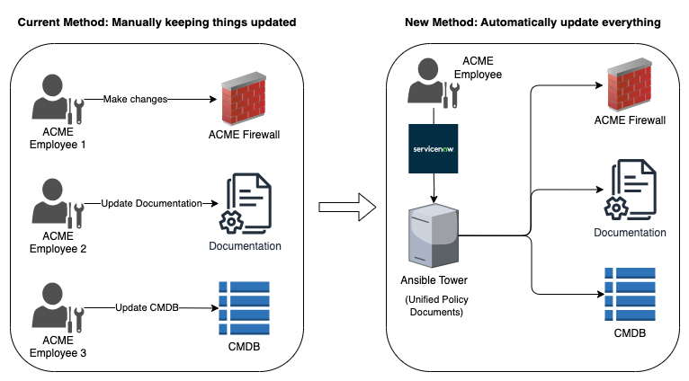
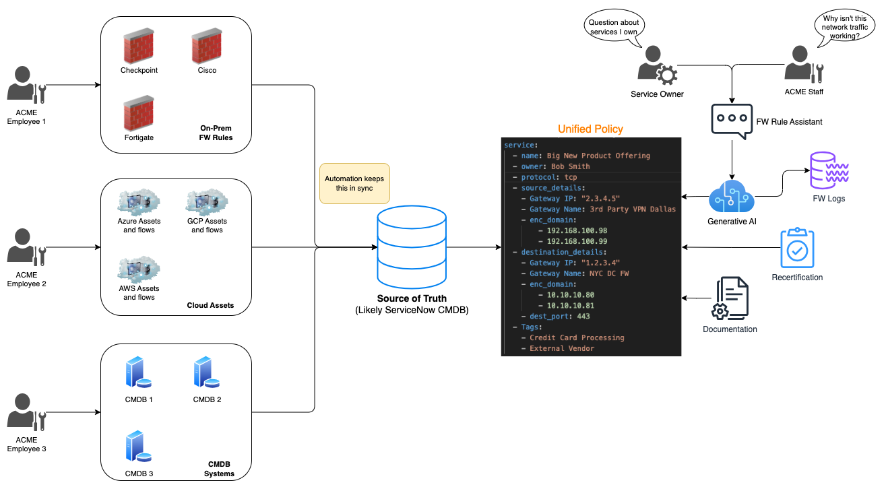
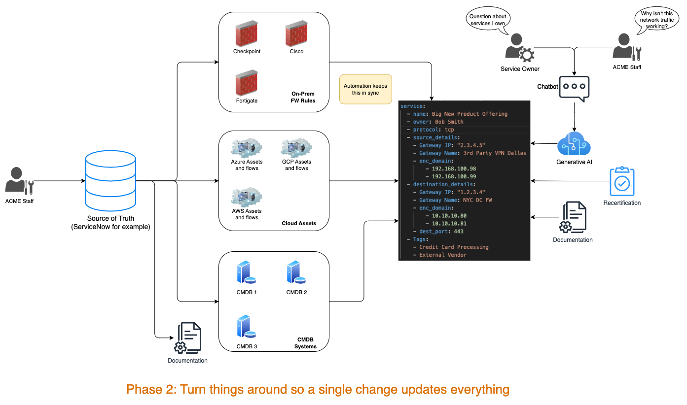
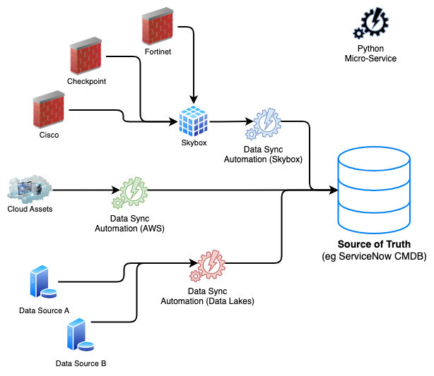

---
tags:
  - ServiceNow
  - Python
  - Documentation
---
This project is still in the POC phase, but I essentially developed a "firewall rules as code" system that, to my knowledge, is the first of its kind. 

# Problem
A major bank in the EU has over 1,000,000 firewall rules and they must certify each one of these on a yearly basis for compliance. They are currently failing this which carries substantial penalties with EU regulations. 

This problem is complicated by 20+ years of technical debt and firewalls across the globe. Furthermore, the documentation for all of this is not maintained and the data for all of the various endpoints is spread across 4 different systems, maintained by different people. 

# Solution
- Developed a proof of concept in ServiceNow showing how it could act as the central 'Source of truth'. 
- Developed a YAML structure that allows for various systems (including ChatGPT or other NextGen AI systems) to then parse these rules and look for security issues
- Developed a process for converting firewall rules into YAML and then using GitOps (X as code) mentality to allow for automation with something like Ansible. 
- Having firewall rules in a structured format also allows for automatically generating documentation and network diagrams
- Developed automation and tracking mechanisms to help automate the entire review and recertification process so the right product owners are assigned tasks for the rules related to their product offerings.  

# Result
This POC was created in early 2024 and is still under ongoing discussions with the bank. 

# Design Samples
Below are some of the diagrams that were presented as a part of this. 

## HLD
A very simple diagram showing their current system and what the future could look like. 

## Phase 1
This was a more detailed diagram showing what phase 1 of our project would entail.

## Phase 2
This shows what we would seek to do in phase 2 and how the work is now substantially automated with a single person able to carry things out. 

## Data Sync
Obviously creating a source of truth for something like this would require keeping it up to date. As most of the data actually sits in other systems, we need a way to ensure it is kept up to date in ServiceNow. 

With this proposal, I would have created a series of micro-services to pull and map data from various external sources into ServiceNow. 

