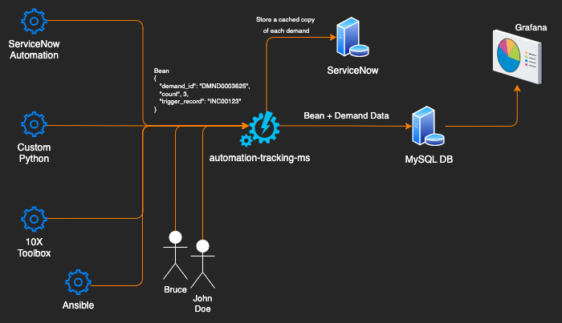

---
tags:
  - Python
  - Micro-Services
---
Named after a favorite childhood TV Show, Mr. Bean is an effort to encourage and reward our internal team members for submitting ideas for Automation. 

# Problem
Many people are afraid to submit ideas for automation because they fear losing their job. With over 1,200 employees in our division, there is incredible potential for automating various aspects of a job, but unless people come forward with ideas or problems, we aren't always aware of them. 

# Solution
A tool that helps track every time an automation runs (bean counting). We then track that bean back to the original submission so the author gets credit. 

This data is then pulled into Grafana as a dashboard for Management, showing them various key metrics that help reward and recognize people for submitting automations. 

- Who has saved us the most time with their ideas
- Which developers are doing the most to help
- Which teams are seeing the best improvements
- Which automations are helping us to lower our risk exposure
- Which automations are helping to improve customer satisfaction? 

The design of this allowed for any team of developers to easily send a PUT request to a micro-service I built. This means that whether the automation runs from ServicveNow, Ansible, or a Python micro-service itself, the developer and submitter can get credit. They just have to make sure their automation sends a small payload every time the automation runs. 

# Results
This project is stil under active development but has been well received by management. While I do have a working proof of concept in our development environment and executive buy-in, my priorities have shifted and prevented me from being able to pursue this further right now. 