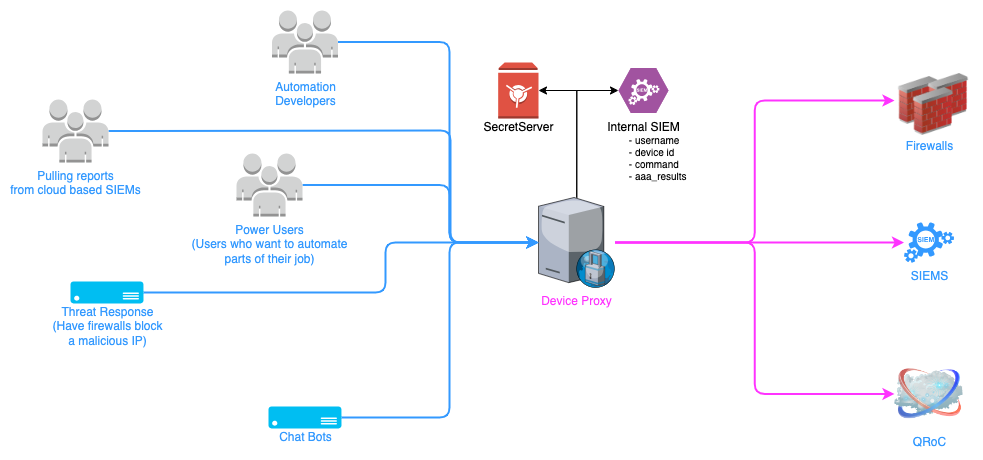

---
tags:
  - ServiceNow
  - Python
  - Micro-Services
  - Integration
---
This is one of my favorite projects as it helps solve a major need in our department, which is allowing automations to connect to various customer devices and platforms we manage. 

# Problem
Due to various security and compliance requirements, credentials for access to customer devices we were responsible for was very difficult for automations. 

Also, there was a lot of fear about letting automations connect to devices in general. 

# Solution
I built a new Secure Device Proxy that would white list approved commands for various vendors (Firewalls, SIEMs etc) and allow any automation to retrieve data (read only) from these devices via standard API calls. 

This ensures the credentials stay safe but anyone (or any automation) could easily use the proxy to retrieve data from customer devices. 

As a part of this effort I also handled getting all of the approvals from our various stakeholders, along with Security and Compliance teams. 

# Result
This was put into production just a few weeks ago (May 2024) and is already solving a crucial problem for one of our VIP customers. 

I combined my new proxy with automations in ServiceNow (that I also built) and now we can easily retrieve data from customer devices. 

